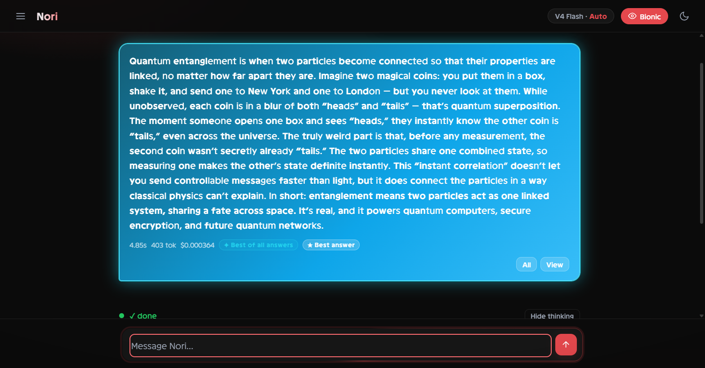
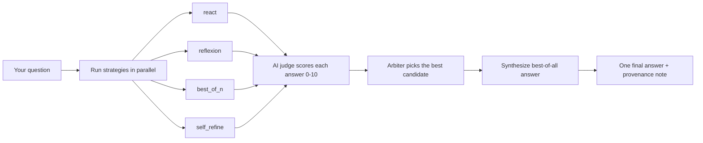

# nori

**Ask once. Get the best answer — with the thinking shown.**

nori is an evidence-driven AI answer engine with a polished, bring-your-own-key
chat UI. Instead of one blind guess, it runs several strategies in parallel,
streams each model's real chain-of-thought live, ranks the results, and then
**synthesizes the best parts of every candidate into a single final reply** —
so the answer you actually read is better than any single attempt.



[](https://www.python.org)
[](LICENSE)
[](pyproject.toml)
[](tests)
[]

## Table of contents

- [Features](#features)
- [Why it's different](#why-its-different)
- [How it works](#how-it-works)
- [Quickstart](#quickstart)
- [Requirements](#requirements)
- [Installation](#installation)
- [Configuration](#configuration)
- [Usage](#usage)
  - [Chat UI (recommended)](#chat-ui-recommended)
  - [Terminal Q&A](#terminal-qa)
  - [Benchmarks](#benchmarks)
- [Providers](#providers)
- [Benchmark suites](#benchmark-suites)
- [Measured results (honest)](#measured-results-honest)
- [Project structure](#project-structure)
- [Adding a strategy](#adding-a-strategy)
- [Feature flags](#feature-flags)
- [Documentation](#documentation)
- [FAQ](#faq)
- [Roadmap](#roadmap)
- [Contributing](#contributing)
- [License](#license)

## Features

| | |
|---|---|
| Visible reasoning | Real hidden chain-of-thought streams live into per-strategy, independently collapsible **Reasoning** blocks |
| Best-of-all answers | The workflow merges the strongest parts of every candidate into one final answer, with a "which parts came from where" note |
| Bring your own key | DeepSeek, OpenAI, GitHub Models or Ollama — pasted in Settings, connection-tested, stored locally, hot-swapped with no restart |
| Auto / Dev modes | Auto returns one clean synthesized answer; Dev shows every strategy card, scores and ratings |
| Answer gallery | One **All** button opens every original candidate with Prev/Next + arrow-key stepping |
| Zero dependencies | Entire runtime is Python's standard library — no third-party packages |
| Deterministic | Calibrated MockLLM + per-run reseeding make tests and benchmarks reproducible |
| Evidence-driven | Every strategy decision is traced to peer-reviewed research; honest results, including negatives |
| Local & private | Your questions and answers stay in local `sessions/` files; keys never leave the machine |
| Cross-platform | Windows, macOS and Linux; TTY-aware output with clean ASCII fallback |

## Why it's different

- **Visible thinking** — each strategy's real hidden reasoning streams live into
  independently collapsible **Reasoning** blocks. You see *how* it got there,
  not just the answer.
- **Best-of-all answers** — the workflow merges the strongest parts of every
  candidate into one final synthesized reply (with a provenance note), instead
  of just returning whichever single answer scored highest.
- **Bring your own key** — paste a DeepSeek, OpenAI, GitHub Models or Ollama
  key into the Settings panel: it's connection-tested, stored locally, and
  hot-swapped with no restart.
- **Zero dependencies** — the entire runtime is Python's standard library.
  No `pip install` of packages required.
- **Evidence-driven, not claimed** — every strategy decision is traced to
  peer-reviewed research in [RESEARCH.md](RESEARCH.md); the design contract is
  [ARCHITECTURE.md](ARCHITECTURE.md); measured results — including honest
  negative results — are in [BENCHMARKS.md](BENCHMARKS.md).
- **Deterministic by default** — a calibrated `MockLLM` makes tests and
  benchmarks reproducible, so strategy comparisons are causal, not anecdotal.
- **Never worse, by construction** — a selection guard and a no-regression
  synthesis guard make it a *design property* that the shipped answer is never
  worse than the best candidate (proved by property tests and a ground-truth
  `never-worse` benchmark).

## How it works

For every question, nori runs a small evidence-driven workflow:



1. **Run** — several agent strategies answer in parallel (ReAct, Reflexion,
   Best-of-N, Self-Refine, and more). Each one's real chain-of-thought streams
   into the thinking panel as it happens.
2. **Judge** — a calibrated LLM judge scores every answer 0-10 with feedback
   (the judge prompt is calibrated so scores actually differentiate).
3. **Pick** — an arbiter ranks the candidates and crowns the strongest one.
4. **Synthesize** — the engine merges the strongest parts of *all* candidates
   into one final, polished answer, and that merged answer is what you read —
   with a short note on which parts came from where.

## Quickstart

```bash
# One-time: make `dse` usable from ANY folder (adds pytest for the test suite)
python -m pip install -e ".[dev]"

cd deepseek_engine
python -m pytest tests -q        # 124 tests
python -m dse.chat               # open the chat UI at http://127.0.0.1:8787
```

That's it — no API key is needed to open the UI (you can use Ollama locally for
free, or paste a key in Settings when you're ready).

## Requirements

- **Python 3.10+** (developed and tested on 3.14)
- A model provider. One of:
  - **Ollama** (free, local — no key needed)
  - **DeepSeek API** key (recommended; defaults to `deepseek-v4-flash`)
  - **OpenAI** or **GitHub Models** key
- Nothing else. No node, no database, no compiled extensions.

## Installation

### Option A — install as a package (recommended)

```bash
git clone https://github.com/mattybellx/nori.git
cd nori/deepseek_engine
python -m pip install -e ".[dev]"
```

After that, `python -m dse.chat`, `python -m dse.ask` and
`python -m dse.benchmarks.run_benchmark` work from any directory.

### Option B — run in place (no install)

The runtime has zero third-party dependencies, so you can also just run from
the folder:

```bash
cd nori/deepseek_engine
python -m dse.chat
```

### Option C — double-click

On Windows, `chat.bat` / `ask.bat` (in the repo root or in `deepseek_engine/`)
launch the UI and terminal Q&A directly.

## Configuration

Everything is configured with environment variables or a local `.env` file
(a documented template is in [`.env.example`](.env.example) — copy it to `.env`).

| Variable | Default | Purpose |
|---|---|---|
| `DSE_PROVIDER_KEY` | — | API key for DeepSeek / OpenAI / GitHub Models |
| `DSE_MODEL_CHEAP` | `deepseek-v4-flash` | Model used first by strategies |
| `DSE_MODEL_EXPENSIVE` | `deepseek-v4-flash` | Model used for judges / escalation |
| `DSE_PROVIDER_URL` | per-provider | Optional base URL override (e.g. a proxy) |
| `DSE_TIMEOUT` | `120` | HTTP timeout in seconds |
| `NO_COLOR` / `NO_UNICODE` | — | Force plain terminal output |

You can also set the key from the chat UI (**Settings** panel) — it is saved
to a local `settings.json`, never sent back to the page, and a failing key is
never persisted.

## Usage

### Chat UI (recommended)

```bash
python -m dse.chat     # opens http://127.0.0.1:8787 in your browser
```

- **Auto mode** (default): ask a question and get one clean, synthesized
  answer. Open the thinking panel to watch each strategy reason live; open
  **All** to browse the original candidates (Prev/Next or arrow keys) and
  re-synthesize on demand.
- **Dev mode**: switch in Settings to see all four strategy cards with scores,
  ratings and the manual "Pick best" flow.
- **BYOK**: paste any DeepSeek / OpenAI / GitHub Models / Ollama key in
  Settings. nori tests the connection, auto-detects the provider, shows a
  badge, and hot-swaps the live engine with no restart.
- Extra touches: Bionic reading toggle, light/dark themes, collapsible history
  sidebar, and a live Insights panel (per-strategy scores + improvement trend).

### Terminal Q&A

```bash
python -m dse.ask                                   # interactive REPL
python -m dse.ask --question "why is the sky blue?" # one-shot
python -m dse.ask --stats                           # is it getting better?
python -m dse.ask --audit sessions/ask_2026-08-05.jsonl  # replay a session
```

In the REPL, four strategies answer each question, an LLM judge grades every
answer 0-10 with feedback, and you rate each 1-5. `--stats` shows per-strategy
averages and a first-half-vs-second-half trend. Judge defaults to the fast
answer model; pass `--judge-model deepseek-v4-pro` for a stronger grader.

### Benchmarks

```bash
python -m dse.benchmarks.run_benchmark --seed 0 --n-tasks 48 --suite all   # synthetic
python -m dse.benchmarks.run_benchmark --seed 0 --seeds 3                  # multi-seed
python -m dse.benchmarks.run_benchmark --flag llm_judge:true               # noisy-judge experiment
python -m dse.benchmarks.run_benchmark --provider ollama --suite real      # real LLM (local)
python -m dse.benchmarks.run_benchmark --provider deepseek --suite hard-tuned
```

Every run prints color-coded tables with McNemar significance, bootstrap
confidence intervals, latency, tokens and cost, and writes JSON records to
`benchmarks/results/`.

The **never-worse benchmark** measures the "never worse than your best
candidate" guarantee (selection + synthesis guards) against ground truth on
the checkable suites, and against a de-noised judge on open-ended questions:

```bash
python -m dse.benchmarks.run_never_worse --provider mock --suite all --n-tasks 48
python -m dse.benchmarks.run_never_worse --provider deepseek --suite free --n-tasks 32
# grade with an INDEPENDENT model to break self-grading circularity:
python -m dse.benchmarks.run_never_worse --provider deepseek --suite free --n-tasks 32 --judge-model deepseek-v4-pro
```

The free suite (32 open-ended questions, no ground truth) reports paired
**Wilcoxon signed-rank** significance on the judge scores, not just averages —
so a 6→8 improvement counts, not just a flipped pass/fail bit.

## Providers

All providers speak the OpenAI-compatible chat-completions API via a single
stdlib-only client (`dse/providers.py`).

| Provider | Key needed | Notes |
|---|---|---|
| DeepSeek | Yes | Default; `deepseek-v4-flash` for both tiers |
| Ollama | No | Free, local; any chat-capable model |
| OpenAI | Yes | Standard OpenAI key |
| GitHub Models | Yes (PAT) | Copilot-class models via the OpenAI-compatible endpoint |

> **Honest note:** VS Code Copilot has no public third-party API, so nori
> cannot call Copilot directly. GitHub Models is OpenAI-compatible and serves
> Copilot-class models with a GitHub PAT — that is the supported path.

## Benchmark suites

| Suite | What it measures | Notes |
|---|---|---|
| `all` / `easy` / `hard` | Strategy mechanics on the calibrated MockLLM | Reproducible, causal comparisons |
| `real` | 12 natural-language tasks on a real model | Deterministic checkers, no code execution |
| `hard-real` | 12 deliberately harder multi-step tasks | Compound interest, work rates, traps, algorithm tracing |
| `hard-tuned` | 12 tasks aimed at a strong model's weak spots | Large arithmetic, CRT, expected value |
| `code` | 8 code-generation tasks, output EXECUTED under a timeout | Hidden tests with `FAIL got=... want=...` feedback (opt-in, not a security sandbox) |

## Measured results (honest)

A few headline findings from [BENCHMARKS.md](BENCHMARKS.md) — every number
ships with seed, n, model and hardware:

- **Strategies pay off when the model is weak enough to fail.** On a genuinely
  weak local model (llama3.2:1b), single-shot fails 50-67% of tasks and
  feedback-driven repair recovers failures: react 0.34 → reflexion 0.53 on the
  hard suites (**McNemar p = 0.041**, n=64, combined across two independent
  runs) — **never worse** (b01 = 0), 12/21 recoveries.
- **Resampling without feedback adds nothing.** Best-of-N ties the plain
  baseline exactly (p = 1.0) — consistent with the literature.
- **On a frontier model, everything is easy.** DeepSeek V4 Flash solves 100% of
  the real, hard-real, hard-tuned and code suites single-shot — an honest
  negative result: the strategies add no measurable gain on tasks this model
  already solves. The value shows up in open-ended questions (synthesized
  answers) and with weaker/cheaper model tiers.
- **Judge calibration matters.** An uncalibrated judge scores everything 10/10;
  the calibrated 0-10 judge is what makes strategies visibly differ.

Full details, including negative results and experimental noise studies, are in
[BENCHMARKS.md](BENCHMARKS.md); known limitations are in
[LIMITATIONS.md](LIMITATIONS.md).

## Project structure

```text
deepseek_engine/
├── dse/
│   ├── config.py          # EngineConfig, feature flags, experiment registry
│   ├── llm.py             # LLM protocol + calibrated MockLLM
│   ├── providers.py       # OpenAI-compatible client (DeepSeek/Ollama/OpenAI/GitHub)
│   ├── environment.py     # Task model, deterministic catalog, ACI surface
│   ├── verifier.py        # exact / test / LLM-judge / self-consistency + aggregate
│   ├── router.py          # confidence-based model escalation
│   ├── memory.py          # rolling window + summary + episodic reflections
│   ├── feedback.py        # compiler feedback loop (build→test→lint→sec→perf)
│   ├── agent.py           # Agent protocol + BaseAgent plumbing
│   ├── strategies/        # react, best_of_n, reflexion, self_refine, tree_search,
│   │                      # escalating, escalating_per_step, adaptive
│   ├── orchestration.py   # MoA-lite (flag: multi_agent)
│   ├── ask.py             # interactive Q&A + sessions + stats (terminal)
│   ├── chat.py            # local chat UI server (SSE, zero deps)
│   ├── chat_page.html     # the entire UI, editable without touching Python
│   ├── ui.py              # colors, tables, progress bars (TTY-aware)
│   ├── freeform.py        # PromptTask + LLM judge for free-form Q&A
│   ├── factory.py         # one-call stack assembly (config→agents)
│   ├── realtasks.py / hardtasks.py / codetasks.py   # benchmark task banks
│   └── benchmarks/        # harness + multi-seed + CLI + JSON records
├── tests/                 # pytest suite (124 tests)
├── docs/                  # screenshots
├── BENCHMARKS.md          # measured results incl. negatives
├── ARCHITECTURE.md        # design contract
├── LIMITATIONS.md         # honest limits
├── RESEARCH.md            # evidence base + decision trace
└── README.md
```

## Adding a strategy

1. Subclass `BaseAgent` (or implement the `Agent` protocol) in
   `dse/strategies/`.
2. Register it in `dse/factory.build_default_agents`.
3. Add a hypothesis to `ENGINE_EXPERIMENTS` in `dse/config.py` if it is
   experimental (with a rollback condition).
4. Benchmark it against the baseline — never claim an improvement without the
   harness numbers.

## Feature flags

All experimental techniques are gated:

| Flag | Default | Evidence |
|---|---|---|
| `adaptive_compute` | on | Snell et al. 2024 (see BENCHMARKS §3.4 for the honest negative result) |
| `self_consistency` | on | Wang et al. 2022 |
| `search_reflection` | on | Zhou et al. 2023 (LATS) |
| `llm_judge` | off | experimental (noisy value function) |
| `multi_agent` | off | experimental (cost-heavy; see BENCHMARKS §3.5) |

## Documentation

- [ARCHITECTURE.md](ARCHITECTURE.md) — design contract and module map
- [BENCHMARKS.md](BENCHMARKS.md) — measured results, methodology, negative results
- [LIMITATIONS.md](LIMITATIONS.md) — honest limits and known quirks
- [RESEARCH.md](RESEARCH.md) — evidence base, papers, and decision trace

## FAQ

**Does nori need an API key to start?**
No. You can run it against local Ollama for free, or paste a key in Settings
whenever you like. The UI opens with no key at all.

**Where is my data stored?**
Everything stays on your machine — questions and answers in local
`sessions/*.jsonl` files, your key in `settings.json` (or your `.env`). Nothing
is sent anywhere except to the model provider you configured.

**Why does an answer sometimes take ~30-45 seconds?**
nori runs several strategies in parallel, then a judge and a synthesizer. You
watch the real reasoning stream in live, so you see exactly what it's doing.
Dev mode and shorter questions are faster.

**Can I use my own model / endpoint?**
Yes. Any OpenAI-compatible endpoint works via the base-URL override
(`DSE_PROVIDER_URL` or the Settings panel).

**Is the `code` benchmark a sandbox?**
No — it executes generated code locally under a timeout in a temp directory.
Fine for a single-user machine; not an OS-level security boundary. See
[LIMITATIONS.md](LIMITATIONS.md).

## Roadmap

- [x] Multi-strategy engine with evidence-based benchmarking
- [x] Local chat UI with live thinking + synthesized best-of-all answers
- [x] Bring-your-own-key settings with hot-swap
- [ ] Hosted demo (sandboxed) so people can try it without installing
- [ ] User accounts + ratings synced across devices
- [ ] Plugin strategy packs (share your own strategy recipes)
- [ ] Mobile-friendly layout

## Contributing

Contributions are welcome. The core rules are the same ones the project runs
on:

- **Never claim an improvement without harness numbers.** Add or extend a
  benchmark and show the result.
- **Keep the runtime dependency-free** — stdlib only.
- **Keep experiments behind feature flags** with an explicit hypothesis and a
  rollback condition.
- **Keep it deterministic** — tests and benchmarks must be reproducible.
- Report honest negative results; they are as valuable as wins.

1. Fork the repo
2. Create a feature branch
3. Add a test for your change (124 and counting)
4. Open a pull request

## License

[MIT](LICENSE)
